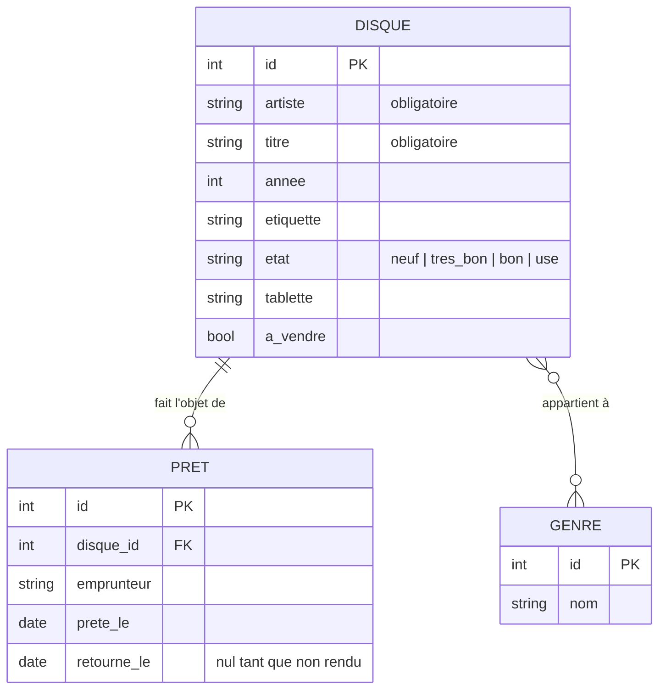

# Conception technique

> [!IMPORTANT]
> **Gabarit — exemple abrégé.** Chaque section montre le format sur un exemple.
> Votre soumission doit être précise pour tout ce que touche le sprint 1 et
> compter **3 décisions techniques** au registre — voir
> [l'énoncé](https://archambaultv.github.io/2026A-420-5D1-MA-Gr2/docs/evaluations/soumission#3-conception-technique--03-conceptionmd).

## Modèle de données initial

Hypothèse de travail. Les entités touchées par le sprint 1 (`DISQUE`) sont
détaillées; `PRET` et `GENRE` ne sont qu'esquissées — elles seront précisées au
raffinement avant les sprints 2 et 3.

## Principaux écrans

> [!NOTE]
> Sillon est une application de bureau : elle a des **écrans**, pas de routes.
> Votre projet web, lui, doit lister les **routes de pages**, les **points
> d'accès de l'API** du sprint 1 et les **événements temps réel** prévus.

Écrans du sprint 1 seulement; les familles « prêts », « import » et
« statistiques » seront détaillées à leur sprint.

| Écran | Rôle |
|---|---|
| Catalogue | liste des disques, champ de recherche intégré ([maquette](maquettes/catalogue-recherche.svg)) |
| Fiche d'un disque | création et modification, validation des champs |

## Maquettes

Les écrans clés sont dans [maquettes/](maquettes/). Pour un projet web,
l'écran où se joue la **fonctionnalité temps réel** est obligatoire parmi les
4 à 5 maquettes.

## Registre de décisions

> [!NOTE]
> Une décision est montrée en exemple; l'énoncé en demande **trois**.

### D1 — Où vivent les données ?

- **La question.** Le catalogue doit survivre aux redémarrages et supporter la
  recherche sur 1 000 disques : un fichier JSON relu en mémoire, ou une base
  SQLite ?
- **Options envisagées.** (a) Un fichier JSON unique, simple à lire et à
  sauvegarder; (b) SQLite embarquée.
- **Décision.** SQLite.
- **Raison.** La recherche et les statistiques deviennent des requêtes plutôt
  que du code maison; l'intégrité (un prêt pointe toujours vers un disque) est
  garantie par le schéma; et une écriture interrompue ne corrompt pas tout le
  catalogue.
- **Ce que ça coûte.** Un schéma à migrer à chaque évolution du modèle, et une
  dépendance native à empaqueter avec l'application. Le fichier JSON reste la
  solution de repli si l'empaquetage pose problème au sprint 1.
